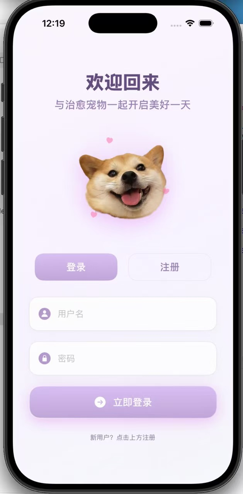
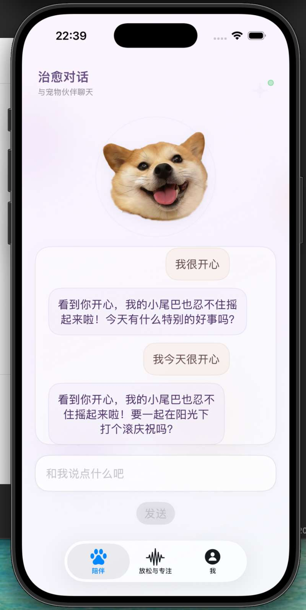
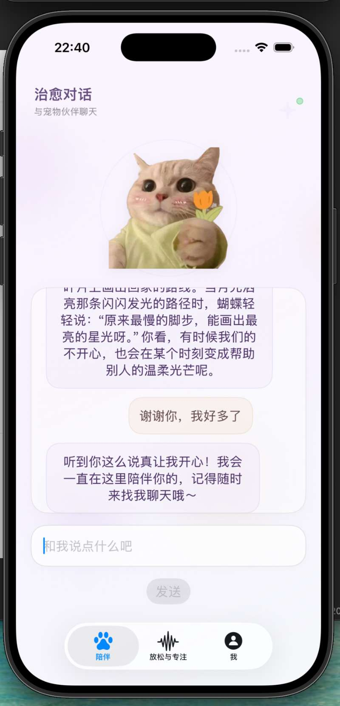
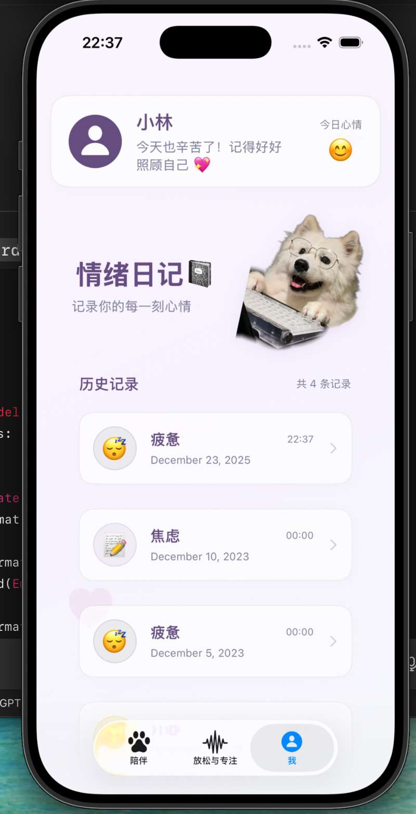
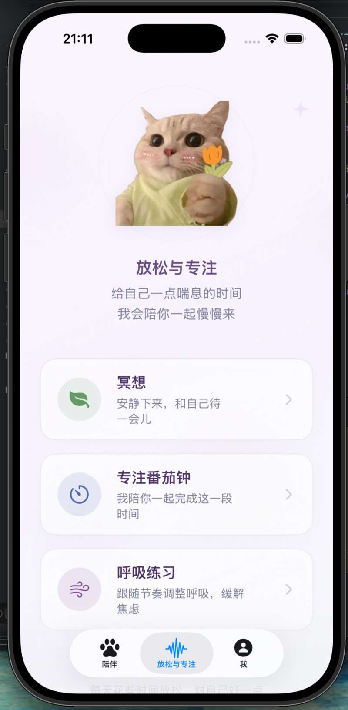
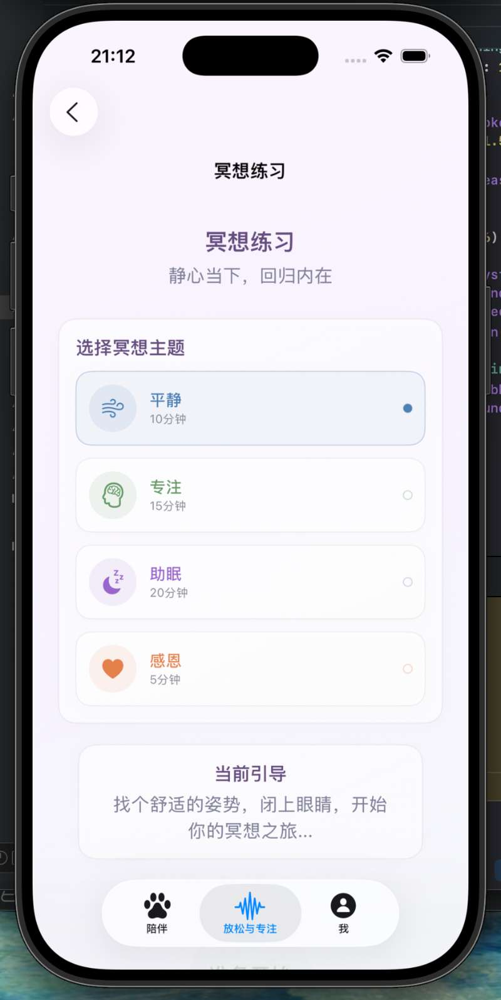
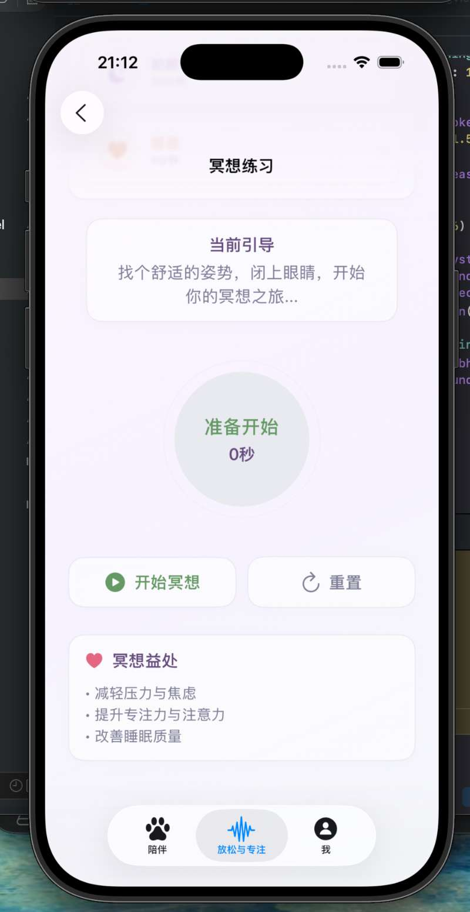
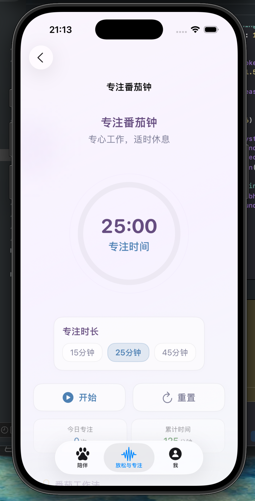

# HealingPet

<p align="center">
  
</p>

## HealingPet

一个基于 `SwiftUI` 的治愈系 iOS 电子宠物应用原型。  
通过 **AI 陪伴对话**、**情绪记录** 与 **冥想 / 专注**，提供轻量而温柔的情绪陪伴体验。


---

## 项目概述

`HealingPet` 希望把“情绪陪伴”做得更柔和、更轻盈。

它不是单纯的聊天应用，也不是单一的番茄钟工具，而是把三类体验放在一起：

- **陪伴**：像宠物一样和用户对话
- **记录**：把情绪状态沉淀为可查看的数据
- **放松**：通过冥想与专注页面延伸情绪照顾场景

整个项目基于 `SwiftUI` 构建，当前已完成原型阶段的主要界面与基本交互流程

---

## 核心亮点

### AI 情绪陪伴
- 结合 DeepSeek 接口进行文本情绪分析
- 根据输入内容生成安慰式回复
- 让“宠物陪伴”具备更真实的互动感

### 治愈型产品方向
- 以宠物形象作为情绪交互载体
- 聊天、记录、放松三个模块围绕同一主题展开
- 更偏产品化体验，而不只是单个功能演示

### SwiftUI 原型完整
- 已具备 Tab 页面结构
- 已拆分 `Models / ViewModels / Views / Services`
- 后续可继续扩展资源、动画、持久化和账号系统


## 功能模块

### 1. 陪伴聊天

用户可以在首页与电子宠物进行对话。

当前交互流程：

1. 输入一段心情文字
2. 发送给 DeepSeek 进行情绪分析
3. 返回安慰文本 / 情绪回复
4. 显示在聊天记录中
5. 根据结果更新宠物展示状态


---

### 2. 情绪记录

应用中提供了独立的记录页面，用于展示历史情绪信息。

当前支持：

- 情绪类型展示
- 日期展示
- 聊天成功后新增一条记录

---

### 3. 放松与专注

除了聊天之外，项目还加入了两个辅助治愈模块。

#### 冥想
- 提供冥想引导文案
- 使用渐变背景营造氛围
- 预留音频播放逻辑

#### 番茄钟
- 默认 `25` 分钟倒计时
- 支持开始 / 停止
- 结合宠物视觉元素增强页面趣味性

---

## 页面展示

> 以下图片来自项目中的 `HealingPet/screenshots` 文件夹。

### 首页 / 聊天体验

<p align="center">
  
  
</p>

### 情绪记录 / 功能页面

<p align="center">
  
</p>

### 更多成果截图

<p align="center">
  
  
  
  
</p>

---

## 技术栈

- `Swift`
- `SwiftUI`
- `Combine`
- `UIKit`
- `AVFoundation`
- `UserNotifications`
- DeepSeek Chat Completions API

---

## 项目结构

```text
HealingPet/
├─ README.md
└─ HealingPet/
   ├─ HealingPet.xcodeproj
   ├─ HealingPet/
   │  ├─ Assets.xcassets/
   │  ├─ Models/
   │  ├─ Services/
   │  ├─ ViewModels/
   │  ├─ Views/
   │  ├─ AppDelegate.swift
   │  ├─ ContentView.swift
   │  └─ HealingPetApp.swift
   └─ screenshots/
```

---


## 快速开始

### 环境要求

- macOS
- Xcode 26 或更高版本
- iOS 模拟器或真机

### 运行步骤

1. 使用 Xcode 打开 `HealingPet/HealingPet.xcodeproj`
2. 选择模拟器或真机设备
3. 在 Scheme 的环境变量中添加：

```text
DEEPSEEK_API_KEY=你的密钥
```

4. 运行项目

---


## License

当前仓库暂未添加开源许可证。
